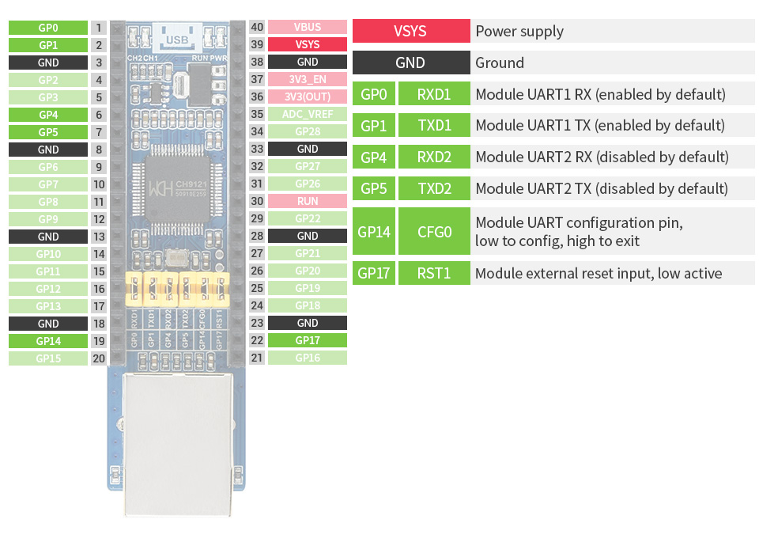

# pico-eth-ch9121

Micropython flask-like for raspberry pi pico and pico-eth-ch9121 Ethernet to UART converter.

## ressources

Pico-eth-ch9121:
- [constructor wiki](https://www.waveshare.com/wiki/Pico-ETH-CH9121).
- [ETH-01.pdf](https://h-2technik.com/online/webee/ETH-01/H2_ETH-01.pdf)

Raspberry pi pico micropython:
- [firmware](https://micropython.org/download/rp2-pico/).
- [Documentation](https://www.raspberrypi.com/documentation/microcontrollers/raspberry-pi-pico.html#technical-specification).

## Pin



## Lexic

- Pico: Raspberry pi pico Board.
- ch9121: Pico-eth-ch9121 Board.
- Lan: Local Area Network.

## Setup the Pico-eth-ch9121 Board

The configuration for TCP server is stored in `config.py`.

## project structure

1. `main.py` is the entry point of the code for the pico.
1. `lib` is the default directory for the modules. No need of `__init__.py` file. Our libraries will be stored there.
1. `lib\server.py` is the class for the ch9121 server with the UART0 configuration.
1. `lib\web.py` is the tiny framework (flask-like) to manage the request and response.
1. `lib\action.py` is only for the exemple.

## exemple

`main.py`

```py
import uasyncio as asyncio
from ujson import dumps, loads
from config import WEB_CONFIG
from server import CH9121
from web import App, reponse
from action import do_led

# Setup the server and the App
server = CH9121()

loop = asyncio.get_event_loop()
print("start config")
loop.run_until_complete(server.set_tcp_server(**SERVER_CONFIG))
print("config complet")
loop.close()

app = App(
    server=server,
    token=WEB_CONFIG["TOKEN"]
)

# Route section
@app.route('/', methods=["POST"], security=True)
def main(request):
    actions = loads(request.headers["actions"])
    do_led(actions["LED"])
    return reponse(
        http_code=200,
        body=dumps(actions),
        content_type="json"
    )

# Loop section
loop = asyncio.get_event_loop()
loop.create_task(app.serve())
loop.run_forever()

```

The very important part is `@app.route('/', methods=["POST"], security=True)`
1. the `route` (here is the root route), Each route must be different and they is no match pattern.
1. the `methods` allowed (POST, GET...).
1. the `security` (it is optional). The define token in the config.py must be past to the request in the header with the key `token`.

## IDE

vs-code with the pico-go extension is very usefull for developping the project.
- tips: add in `.vscode\settings.json `"python.analysis.extraPaths": [".vscode\\Pico-Stub\\stubs", "lib"]` to be in the same condition as the pico.

Thonny is more stable to upload and run the code on the pico than pico-go extension.
